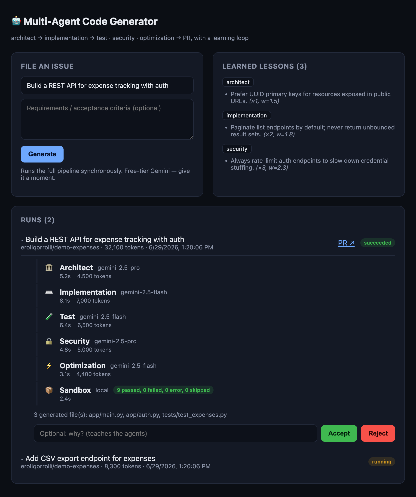

# Multi-Agent Code Generator

You open a GitHub issue like *"Build a REST API for expense tracking with auth."*
A few minutes later, a pull request shows up with working, tested code — written,
reviewed, and checked by five AI agents that each do one job and hand their work
to the next. When you accept or reject the PR, the system remembers why and does
better next time.

This is a portfolio project. It runs on the **free tier of Google's Gemini API**,
so it costs nothing to try.

---

## How it works

The work is split between five agents. Each one is good at a single thing, and
they pass their results down the line:

1. **Architect** — reads the request and decides the plan: the tech stack, the
   database tables, and the API endpoints.
2. **Implementation** — turns that plan into actual source files.
3. **Test** — writes tests for the code.
4. **Security** — looks for vulnerabilities and unsafe patterns.
5. **Optimization** — looks for slow or wasteful code and suggests fixes.

A coordinator (the "orchestrator") runs them in the right order. The Architect
goes first because everything depends on its plan. Once the code exists, the
Test, Security, and Optimization agents all run at the same time, since none of
them depends on the others.

Here's the part that makes it more than a chatbot in a loop:

- **The tests really run.** After the Test agent writes tests, the system
  executes them in a sandbox and checks the result. If they fail, the code goes
  back to the Implementation agent to be fixed — and the loop repeats until the
  tests pass (or it runs out of attempts). The agent can't just *claim* the code
  works; it has to actually work.
- **It learns from feedback.** When you accept or reject a PR, the system turns
  that into a short, plain-English rule (for example, *"always add rate limiting
  to login endpoints"*) and feeds it into the right agent's instructions next
  time. These rules are saved as normal database rows you can read — nothing
  hidden.

```
issue ──> Architect ──> Implementation ──> [ Test · Security · Optimization ]
                              ^                          |
                              |                          v
                              └──── fix & retry ◄── tests pass? ──> Pull Request
                                                                          |
                                                                          v
                                                      you accept/reject ──> it learns
```

## The dashboard

A web dashboard to watch it work: file an issue, follow each agent step by step
(with the model used, time taken, and tokens spent), see the real test results
from the sandbox, and accept or reject the result — which is what feeds the
learning loop.



You can try the dashboard with realistic demo data and **no API key** — it ships
with a seed script:

```bash
cd backend && source .venv/bin/activate
export DATABASE_URL="sqlite+aiosqlite:///./demo.db"
python -m app.seed                 # loads example runs, steps, and lessons
uvicorn app.main:app               # API at http://localhost:8000

cd ../frontend && npm install && npm run dev   # dashboard at http://localhost:3000
```

## Tech stack

| Part        | Choice                                              |
| ----------- | --------------------------------------------------- |
| Backend     | Python 3.12, FastAPI (async)                        |
| AI model    | Google Gemini (free tier) — swappable for any LLM   |
| Database    | PostgreSQL with SQLAlchemy (async)                  |
| Frontend    | Next.js + TypeScript (a dashboard to watch runs)    |
| GitHub      | GitHub App + webhooks                               |
| Deployment  | Docker / docker-compose                             |

The AI model sits behind a small interface, so swapping Gemini for Claude,
OpenAI, or a local model means writing one file — no other code changes.

## Project status

It's a work in progress. Being honest about what's real:

**Done and verified**
- The full pipeline runs end-to-end on real Gemini: all five agents coordinate,
  the fix loop repairs failing code, and it produces a complete project. A real
  run generated a working FastAPI app, real security findings, and optimizations.
- The sandbox actually runs the generated tests in an isolated virtualenv and
  feeds real pass/fail back into the fix loop.
- A deterministic test suite drives the **whole pipeline with no API key** (a stub
  model), covering the happy path, the fix loop, and the learning loop.
- The learning loop: PR feedback distills into reusable rules, and closed PRs feed
  back automatically (merged = accepted, closed = rejected).
- Optional API-token auth, async Alembic migrations, and graceful quota handling.
- The monitoring dashboard (dark, with run timelines and feedback).

**Not done yet**
- One fully-green generated test run (the last run found a real bug in the AI's
  own code; the improved fix loop should close it — pending free-tier quota).
- Live progress streaming (the dashboard refreshes on a timer for now).
- The GitHub issue→PR flow tested against a real repo (code is in place).
- Deployment.

The roadmap at the bottom has the full list.

## Getting started

### 1. Get a free API key

Grab one from [Google AI Studio](https://aistudio.google.com/apikey), then:

```bash
cp .env.example .env      # paste your key into GEMINI_API_KEY
```

### 2. Quickest way to see it work (terminal, no setup)

This runs the whole pipeline and prints what each agent produced. It uses a local
file as the database, so you don't need Postgres or Docker.

```bash
cd backend
python3 -m venv .venv && source .venv/bin/activate
pip install -e ".[dev]"

export GEMINI_API_KEY=your-key
export DATABASE_URL="sqlite+aiosqlite:///./demo.db"
python -m app.cli "Build a REST API for expense tracking with auth"
```

### 3. The full app (dashboard + database)

```bash
make db                                    # start Postgres in Docker
cd backend && source .venv/bin/activate
uvicorn app.main:app --reload              # API at http://localhost:8000

cd ../frontend && npm install && npm run dev   # dashboard at http://localhost:3000
```

### 4. The automated GitHub flow

To get the "open an issue, get a PR" behavior, you need to register a GitHub App.
Step-by-step instructions are in [docs/github-app.md](docs/github-app.md).

## Running the tests

```bash
cd backend && source .venv/bin/activate && pytest
```

These run without an API key, database, or internet. A stub model drives the
**entire pipeline** — so the tests prove the agents coordinate, the fix loop
repairs failing code, the sandbox tells a passing suite from a failing one, and
the learning loop distills feedback. (Writing these caught two real bugs: an async
session being committed concurrently, and a lazy-load outside the async context.)

## Project layout

```
backend/app/
  llm/        the AI interface + Gemini (swap models here)
  agents/     the five agents and the coordinator
  sandbox/    runs generated tests for real (Docker or local)
  schemas/    the typed data passed between agents
  services/   the learning loop, PR writer, GitHub client
  api/        the web endpoints
  db/         database models
  cli.py      run a job from the terminal
frontend/     the Next.js dashboard
docs/         setup guides
```

## Roadmap

Done recently: ~~auto-feedback on closed PRs~~, ~~optional API auth~~,
~~database migrations~~, ~~full-pipeline tests~~, ~~graceful quota handling~~.

Still ahead, in rough priority order:

1. Add live progress streaming to the dashboard (it polls for now).
2. Verify the GitHub issue→PR flow against a real repo.
3. Pick only the *relevant* learned rules per request (using embeddings) instead
   of the top few.
4. A scoring harness to measure whether the learning loop actually improves
   results over time.
5. Run the sandbox in CI; harden the Docker setup.
6. Deploy it.

## License

MIT — use it however you like.
